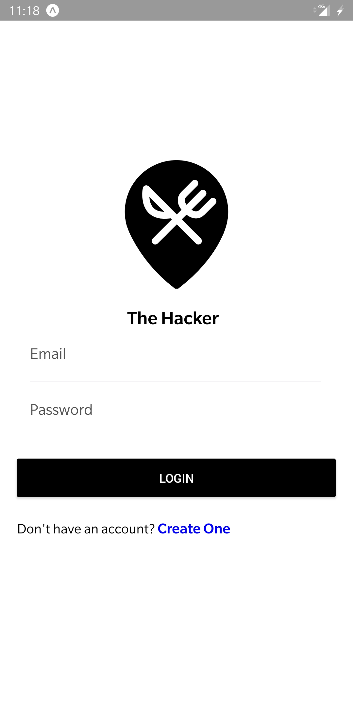
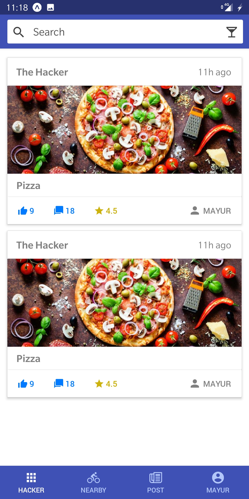
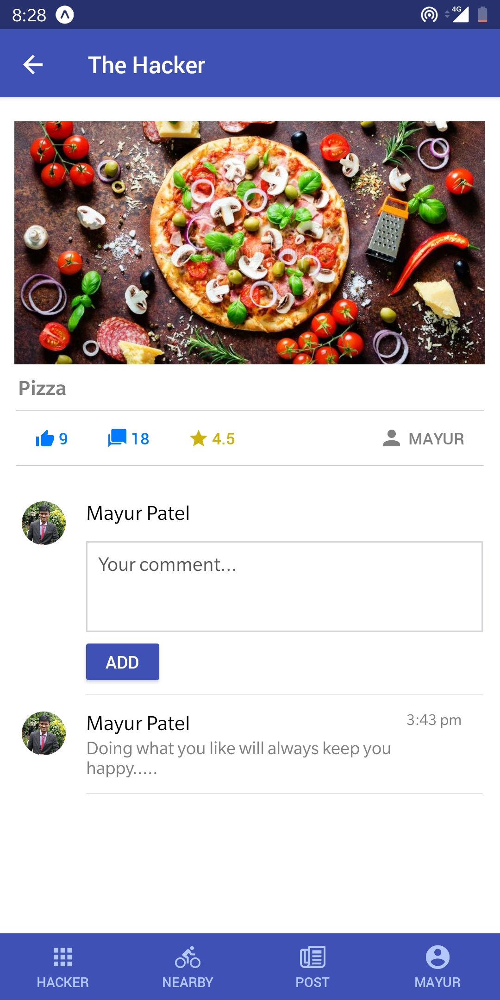
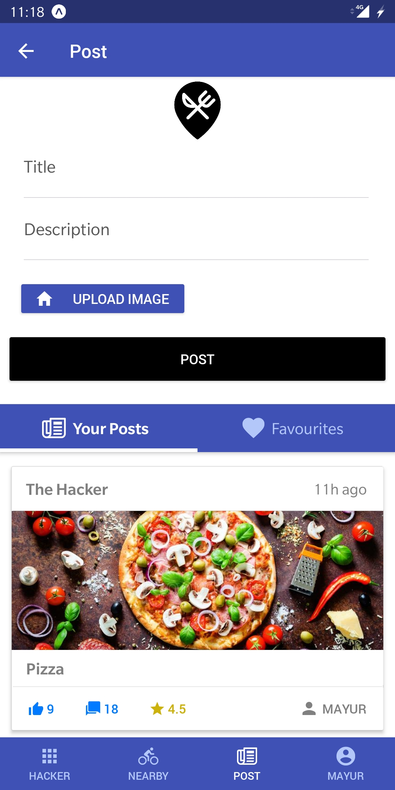
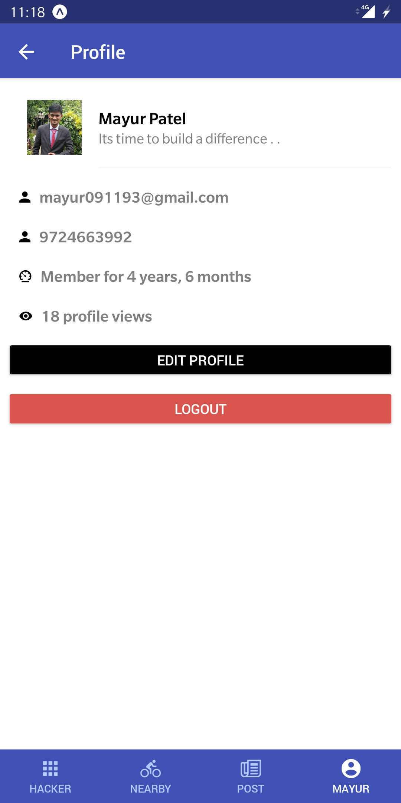
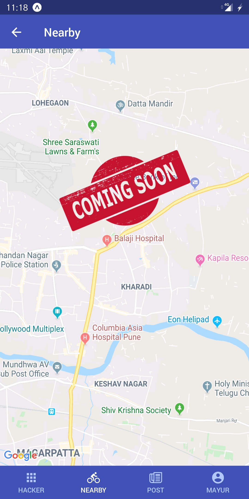

# vue-native-app-starter

## Built using

* [Vue Native](https://vue-native.io/)
* [Native Base](https://nativebase.io/)
* [Expo](https://expo.io/)
* [Vue Native Router](https://vue-native.io/docs/vue-native-router.html)
* [react-native-maps](https://github.com/react-native-community/react-native-maps)
* [expo-image-picker](https://docs.expo.io/versions/latest/sdk/imagepicker/)
* [expo-permissions](https://docs.expo.io/versions/latest/sdk/permissions/)

## Installation

* **Clone and install packages**

```
git clone https://github.com/mayur091193/vue-native-app-starter.git
cd vue-native-app-starter
npm install
```

* **Run**
    * Run `npm start` in your terminal. This command will run your app in development mode with an interactive prompt.
    
While running the project, if may face any package dependencies issue, you can remove that specific package using `npm uninstall` and install the same using `expo install package-name`.
    
***Feel free to reach out to me at "mayur091193@gmail.com" in case of any questions/queries.***   

## Demo

I've published the app to the expo at (The Hacker)[https://expo.io/@mayur.911/neverstop]. To run, you can download (Expo client on Android or IOS)[https://expo.io/tools#client] and scan the QR code on the link to run.
    
## Screens

1. Login screen
2. Item listing screen
3. Item details screen
4. Post Item screen (with image upload)
5. My profile screen
6. Map view screen 

## Screens UI

<p float="left">
	<kbd>

		</kbd>
	<kbd>
	
	</kbd>
	<kbd>

	</kbd>
</p>
	
<p float="left">
	<kbd>

	</kbd>
	<kbd>

	</kbd>
	<kbd>

	</kbd>
</p>

## Roadmap

* Sidebar
* Validations
* Charts
* Backend(Most likely [Python](https://www.python.org/))

Above list will never end. :)

## License

[MIT](http://opensource.org/licenses/MIT)
